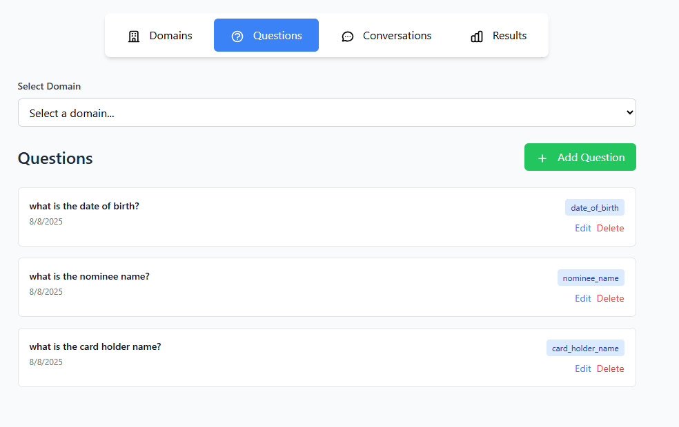

# README.md

# Call Center RAG Application

A web application for analyzing call center conversations using Retrieval-Augmented Generation (RAG) with GPT-3.5-Turbo. Upload transcripts, create dynamic questions, and extract key information using AI-powered lead detection and information retrieval.




## Features

- **File Upload**: Upload 30-40 minute call center transcript text files
- **Dynamic Questions**: Add, edit, and remove questions with a card-based interface
- **AI Lead Detection**: Automatically detect key leads/variables from questions using GPT-3.5-Turbo
- **RAG Pipeline**: Extract corresponding values from transcripts using Retrieval-Augmented Generation
- **Pydantic Validation**: Robust data validation and error handling
- **Real-time Processing**: Efficient extraction of 8-10+ variables from long transcripts
- **Vector Database**:Vector database integration ChromaDB
- **Database Store**:Persistent storage to MongoDB
- **Embedding Model**:Advanced embedding models all-MiniLM-L6-v2


## Architecture

```
├── core/
│   ├── config.py               # Configuration settings 
│   └── tasks.py                # Background processing tasks
├── services/
│   ├── rag_service.py         # RAG implementation
│   ├── ai_llm.py              # OpenAI integration
│   └── lead_generation.py     # Lead detection service
├── api/
│   ├── endpoints.py           # FastAPI route handlers
│   └── models.py              # Pydantic models
├── frontend/                  # Frontend assets
│   ├── templates/             # HTML templates
│   ├── css/                   # Stylesheets
│   └── scripts/               # JavaScript
├── .env
├── requirements.txt
├── main.py                     # Application entry point
└── README.md
```


## Database Structure

```
Collections:
├── domains              # Domain management
│   ├── domain_id (ObjectId)
│   ├── domain_name (str)
│   ├── created_at (datetime)
│   └── updated_at (datetime)
│
├── questions           # Questions per domain
│   ├── question_id (ObjectId)
│   ├── domain_id (ObjectId, ref to domains)
│   ├── question_text (str)
│   ├── created_at (datetime)
│   └── updated_at (datetime)
│
├── conversations       # Uploaded conversation files
│   ├── conversation_id (ObjectId)
│   ├── domain_id (ObjectId, ref to domains)
│   ├── filename (str)
│   ├── content (str)
│   ├── user_session_id (str)
│   ├── created_at (datetime)
│   └── processed (bool)
│
└── results            # Processing results
    ├── result_id (ObjectId)
    ├── conversation_id (ObjectId)
    ├── question_id (ObjectId)
    ├── extracted_answer (str)
    ├── confidence_score (float)
    ├── leads_detected (array)
    └── created_at (datetime)
```

## Setup & Installation

### Prerequisites

- Python 3.10+
- OpenAI API key

### Installation

1. **Clone and navigate to the project directory**

2. **Install dependencies**:
```bash
pip install fastapi uvicorn openai aiofiles jinja2 python-multipart pydantic
```

3. **Set environment variables**:
```bash
export OPENAI_API_KEY="your-openai-api-key-here"
```

4. **Run the application**:
```bash
python main.py
```

5. **Access the application**:
   - Open your browser to `http://localhost:8000`

## Usage

### 1. Upload Transcript
- Click the upload area or drag & drop a `.txt` file
- File size limit: 10MB
- Supported formats: `.txt`, `.text`

### 2. Manage Questions
- Click "Add Question" to create new questions
- Edit existing questions with the "Edit" button
- Delete questions with the "Delete" button
- Questions are categorized (General, Customer Info, Product, Support)

### 3. Process Questions
- Click "Process Questions" to start AI analysis
- The system will:
  - Generate leads/keywords from each question
  - Search transcript chunks for relevant information
  - Extract answers using GPT-3.5-Turbo
  - Calculate confidence scores

### 4. View Results
- Results display extracted answers
- Shows detected leads for each question
- Confidence scores indicate reliability
- Context chunks show information sources used

## API Endpoints

### File Management
- `POST /api/upload` - Upload transcript file
- `GET /api/session/{user_id}` - Get session data

### Question Management
- `POST /api/questions/{user_id}` - Add question
- `PUT /api/questions/{user_id}/{question_id}` - Update question
- `DELETE /api/questions/{user_id}/{question_id}` - Delete question

### Processing
- `POST /api/process/{user_id}` - Process all questions
- `GET /api/results/{user_id}` - Get processing results

## Technical Details

### RAG Pipeline
1. **Text Chunking**: Transcript split into overlapping chunks (1000 words, 200 overlap)
2. **Lead Generation**: GPT-3.5-Turbo extracts key terms from questions
3. **Chunk Retrieval**: Keyword-based search finds relevant transcript sections
4. **Answer Extraction**: GPT-3.5-Turbo generates answers from retrieved context

### Data Models (Pydantic)
- `Question`: User questions with validation
- `LeadExtractionResult`: Processing results with confidence scores
- `UserSession`: Complete user session data
- `ProcessingRequest`: Request validation

### Security & Validation
- File type validation (text files only)
- File size limits (10MB max)
- Input sanitization and validation
- Pydantic models ensure data integrity

## Configuration

Edit `core/config.py` to modify:
- OpenAI API settings
- File upload limits
- RAG parameters (chunk size, overlap, top-k results)

## Limitations

- In-memory storage (use database for production)
- Simple keyword-based retrieval (consider vector embeddings for better accuracy)
- OpenAI API rate limits apply
- Single-user sessions (extend for multi-user support)

## Future Enhancements

- Multi-user authentication
- Real-time websocket updates
- Advanced analytics and reporting
